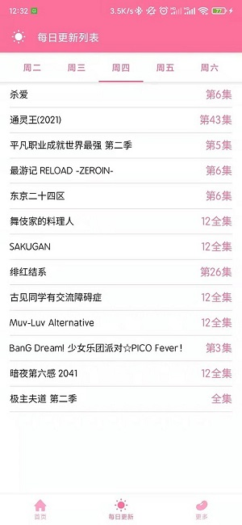

# SakuraAnimePlugin
[**MediaBox插件**](https://github.com/RyensX/MediaBoxPlugin)示例-樱花动漫

## 如何使用
1. 下载安装[MediaBox](https://github.com/RyensX/MediaBox/releases)
2. 下载安装本项目[安装包](https://github.com/RyensX/SakuraAnimePlugin/releases)
3. 打开**MediaBox**启动本插件

## 运行截图
 
 
 

## 免责声明

1. 此软件显示的所有内容，其**版权**均**归原作者**所有。
2. 此软件**仅可用作学习交流**，未经授权，**禁止用于其他用途**，请在下载**24小时内删除**。
3. 因使用此软件产生的版权问题，软件作者概不负责。