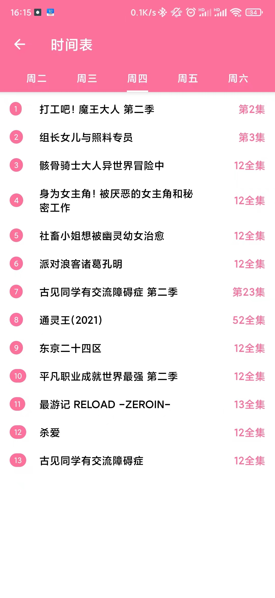

# SakuraAnimePlugin
[**MediaBox插件**](https://github.com/RyensX/MediaBoxPlugin)示例-樱花动漫

## 提供功能
* 番剧推荐
* 番剧分类
* 番剧搜索
* 番剧更新表
* 番剧排行榜
* 番剧播放(倍速/画面比例/弹幕/投屏等)
* 播放历史及进度记录(包括集)
* 自动检查番剧更新并推送

## 如何使用

* 一键安装(**推荐**)

1. 下载安装[媒体盒子](https://github.com/RyensX/MediaBox)
2. 启动媒体盒子打开插件仓库点击自动下载安装**樱花动漫**
3. 启动插件

* 手动安装

1. 下载安装[媒体盒子](https://github.com/RyensX/MediaBox)
2. 下载本项目[插件包](https://github.com/RyensX/SakuraAnimePlugin/releases)
3. 选择插件包打开方式为**媒体盒子-插件安装**
4. 打开**媒体盒子**启动本插件

## 运行截图
      

## 如果觉得不错欢迎Star支持开发

## 免责声明

1. 此软件显示的所有内容，其**版权**均**归原作者**所有。
2. 此软件**仅可用作学习交流**，未经授权，**禁止用于其他用途**，请在下载**24小时内删除**。
3. 因使用此软件产生的版权问题，软件作者概不负责。